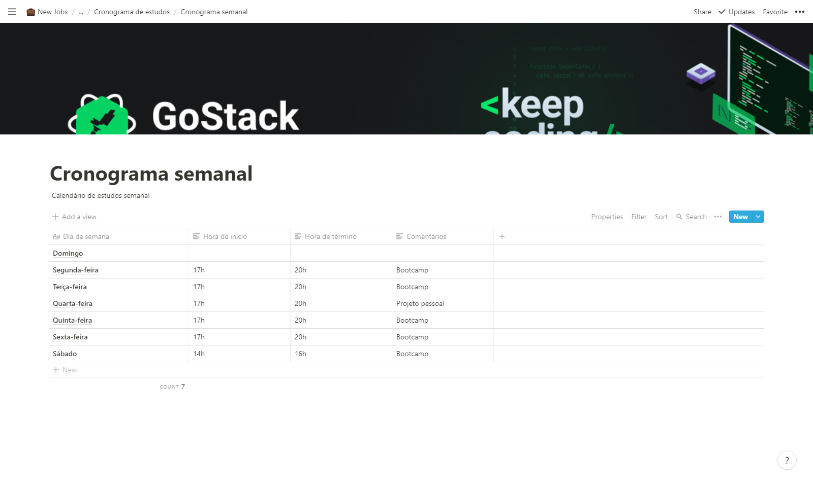
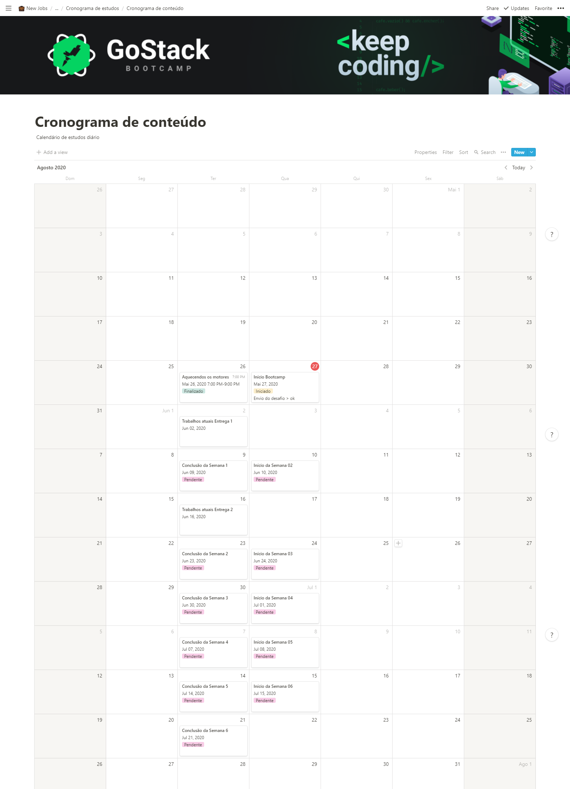

<h1 align="center">GOSTACK 11 CHALLENGE :running:</h1>
<h1 align="center">Rocketseat :rocket:</h1>

  

## 💻 About the Project
<h4>
  - Study schedule.
  </h4>

 ## 💻 Technologies
<h4>
   - Notion
</h4>

<h3 align="center">Weekly schedule :running:</h3>

  

<h3 align="center">Content schedule :running:</h3>

  

## :memo: License

This project is under the MIT license. 
For more details visit: [LICENSE](.github/LICENSE.md).
